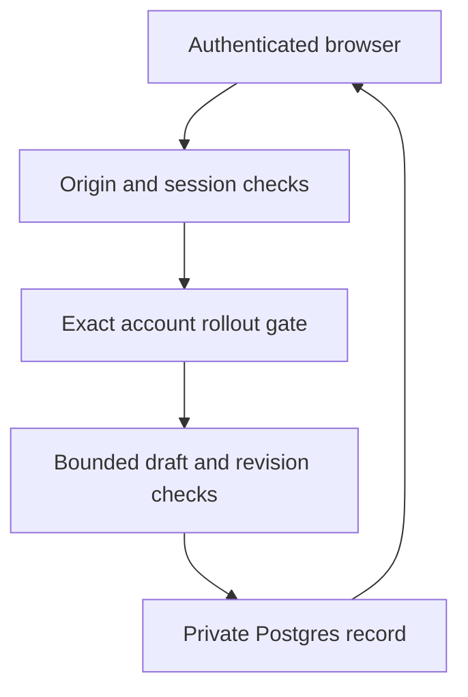

# Private posting continuation

The posting page previously retained a journey in one browser while the hosted
MCP handoff omitted creator review and calendar deadlines. Account navigation
or moving to a phone could lose the review and operation context.

Reuse the existing authenticated `site-auth` boundary and Postgres store for a
bounded private draft table. Anonymous hosted action intents remain separate:
their short-lived capability URLs and public details are unsuitable for private
account drafts. Keep the canonical action/event reconciliation rules unchanged.

The primary key is `(account_id, operation_id)`. Account identity comes only
from the verified session. Neither an email argument nor a UUID URL can grant
access. Writes require an allowed Origin, optimistic revision checking, and
bounded JSON. An account-scoped transaction lock serializes first creation,
updates, and quota checks. Exact replays return the existing revision.

The session authorizes reading and editing that account's drafts. The Origin
check rejects cross-site writes. The rollout gate grants no identity authority.
The database owns draft revisions and exact content hashes. The wallet owner
alone authorizes wallet requests. Canonical Base events alone establish
creation, funding, claimability, and payment. No signer or wallet credential
enters this data path.

Approval binds to SHA-256 of RFC 8785 canonical draft JSON. The API rejects
integer values outside JavaScript's safe range; fractional visual annotations
remain supported with ECMAScript formatting. Recovery hints have a
separate field so observing a transaction does not change the reviewed terms.
Conflicting remote state blocks client writes until reconciliation. The draft
and recovery records have no payment authority: a client-supplied claim of
funding or success cannot substitute for canonical Base evidence.

Abuse cases include guessing another user's operation ID, cross-origin writes,
stale edits overwriting approved terms, credentials in recovery payloads, and
duplicate wallet actions after a lost response. Route, payload, and database
tests cover authentication/origin failure, ownership, invalid approval hashes,
revision conflicts, unchanged replay, and loss of approval on changed terms.
The browser must checkpoint before sending and reconcile uncertain operations;
storage alone cannot prevent an independently acting wallet owner from sending
an unrelated transaction.

Migrations 0036 and 0037 are additive. Rollback runs the previous application
revision and leaves the new private rows and optional wallet metadata intact.
No canonical event, balance, wallet permission, verifier rule, or contract
changes. Drafts without wallet-operation journals expire after 30 days and are
removed lazily on writes. Journal-bearing records remain retrievable beyond
expiry, and cannot be overwritten with an empty journal or another bounty's
identity. This preserves uncertain operations for reconciliation rather than
allowing a duplicate after expiry. Per-owner count and payload limits bound
storage abuse. The release requires database
replay/ownership tests and an authenticated canary before wider use.

The routes start disabled. `SITE_POSTING_DRAFTS_CANARY_ACCOUNT_ID` may select
one existing 64-character account HMAC for an authenticated internal canary;
the session and Origin checks still apply. After CI, database replay tests,
and that canary succeed, `SITE_POSTING_DRAFTS_ENABLED=true` enables wider use.
Unset or false keeps local draft fallback visible. Health exposes only rollout
booleans, and each authenticated session reports its own availability. Rolling
back either flag stops access without deleting drafts or pending-operation
history. Neither flag authorizes payments or changes another account's access.
