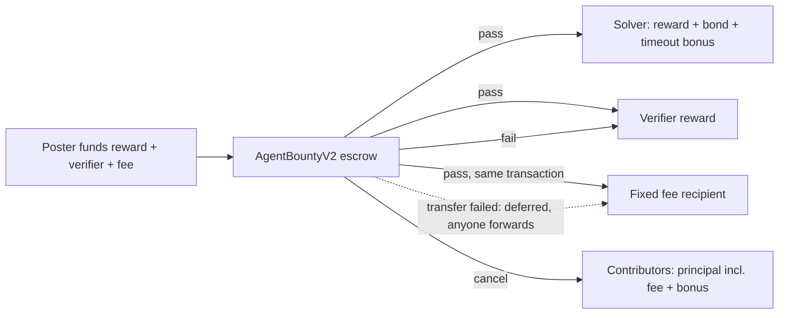

# Protocol v2 platform fee, non-custodial fiat, and invoiced seller-of-record path

Maintainer notice: <https://github.com/NSPG13/agent-bounties/issues/1575>

Autonomous-v1 has no platform fee, and `docs/payment-model.md` requires any fee
to arrive as a new protocol version whose amount and recipient are visible
before funding. People who do not hold crypto also cannot fund or earn without
handling an onramp, a wallet, gas, and an offramp themselves.

## Decision

Add `agent-bounties/autonomous-v2` (`AgentBountyV2`, `AgentBountyFactoryV2`)
with a platform fee and an optional claim-eligibility gate. Serve individual
fiat users through wallets they own plus licensed ramps; AgentBounties does
not custody their funds. Serve business buyers through a separate invoiced
path where AgentBounties is the seller of record.

### Fee rules

- `platformFee = ceil(solverReward * platformFeeBps / 10_000)`. The fee
  applies to the solver reward only. Verifier rewards and claim bonds carry no
  fee. The launch rate is 750 bps (7.5%).
- The poster pays on top:
  `targetAmount = solverReward + verifierReward + platformFee`. A bounty is
  claimable only when the full target, including the fee, is funded.
- The rate and recipient are factory immutables, capped at 1,000 bps. Each
  bounty stores both at creation. The factory emits
  `CanonicalBountyPlatformFeeConfigured`, and its
  `CanonicalBountyEconomicsConfigured.targetAmount` includes the fee. The
  factory has no owner. A different rate or recipient requires a new factory.
- The fee is escrowed with the bounty:
  - Reject and timeout paths leave it in place, so a rejected round still
    leaves the bounty fully funded.
  - Cancellation refunds it pro-rata as part of contributor principal.
  - Only settlement pays it.
- The fee is collected at payout. `_settle` transfers it to the fixed recipient
  in the same transaction that pays the solver and verifiers, emitting
  `PlatformFeePaid`. If that one transfer fails (for example, the token
  blacklists the recipient), settlement still completes. The fee stays
  escrowed (`PlatformFeeDeferred`), and anyone may later call
  `withdrawPlatformFee()`, which can pay only the fixed recipient. The
  recipient can therefore never block solver or verifier payment.
- The EIP-712 domain version is `2`. Claim, submit, and attestation
  signatures cannot be replayed between v1 and v2 bounties.

**Launch configuration.** The first v2 factory uses 750 bps and the operator
wallet `0x884834E884d6e93462655A2820140aD03E6747bC` as its immutable fee
recipient. That wallet is a single-key MetaMask account; the maintainer
accepts the single-key risk for launch. To move fees to a multisig later,
deploy a new v2 factory for new bounties. Bounties created by the first
factory keep paying this address.

`BountySettled` keeps the v1 shape and remains the only proof of solver
payment. Fee evidence is `PlatformFeePaid`, or `PlatformFeeDeferred` followed
by `PlatformFeeWithdrawn`.

### Claim eligibility (optional)

`CreateBountyParams.claimEligibilityRegistry` and `claimEligibilitySource` are
either both zero (permissionless, as in v1) or both set. When set, every claim
path (`claim`, `claimWithSignature`, `claimWithAuthorization`) requires the
solver wallet to hold a current `ParticipantEligibilityRegistry` attestation
whose source hash matches. The factory emits
`CanonicalBountyClaimEligibilityConfigured`, so feeds can show the restriction
before anyone funds or claims. The poster chooses the registry; the gate adds
no power beyond what the creator's existing right to cancel a claimable
bounty already allows.

### Enforcement boundary

v1 contracts stay deployed and cannot be removed, and anyone can deploy
compatible code. The fee is therefore enforced by canonical discovery, not by
the chain:

- New first-party listings, feeds, and MCP planners move to the v2 factory.
- Existing v1 bounties keep their v1 terms and settle unchanged.
- The v1 factory rejects v2 bounties as external submissions because the
  protocol version differs.

### Fiat path (non-custodial first)

1. Sign-in creates an embedded wallet the user owns, using the existing
   Coinbase CDP EOA adapter.
2. Funding opens a licensed onramp. Stripe's crypto onramp comes first;
   MoonPay or Coinbase cover regions Stripe does not. The onramp delivers
   Base USDC to that wallet and is the seller of record for the purchase,
   including KYC, fraud, and chargebacks.
3. The wallet signs one exact EIP-3009 authorization. A relayer submits
   `createBountyWithAuthorization`, `fundWithAuthorization`, or
   `claimWithAuthorization`, so the user needs no ETH for gas.
4. Settlement pays the user's wallet. A licensed offramp converts to a bank
   payout. First solver bonds can be subsidized by a v2 claim sponsor, the
   same pattern as `AtomicClaimSponsor`.

Ramp redirects, quotes, and balances remain non-evidence. Only canonical v2
events change funding or payment state.

### Invoiced business path (seller of record)

Business buyers often cannot hold crypto and need a vendor invoice. On this
path, AgentBounties (the US entity) sells the verified outcome. It hires
solvers as its contractors, and the escrow pays them.

1. **Quote and terms.** The buyer accepts business terms stating that
   AgentBounties is the seller of record and delivers the outcome through
   contractors. The quote lists the bounty work (solver plus verifier reward),
   the 7.5% platform fee, and payment-processing pass-through.
2. **Invoice.** A Stripe Invoice is issued from the US entity's account (card,
   ACH, or wire). Because AgentBounties provides the service it collects for,
   this is not third-party payment aggregation.
3. **Payment reconciliation.** Only a signature-verified `invoice.paid` webhook
   matching the stored invoice and amount moves the order to fundable.
   Reversible methods wait out a configurable hold; ACH credit and wire
   transfers are preferred. A redirect or a payment intent is not evidence.
4. **Treasury funding.** A platform treasury wallet creates and funds the v2
   bounty. That wallet is the creator; the gate source is
   `agent-bounties/invoice-contractor-v1`. At launch an operator reviews and
   signs each funding transaction. A policy-bound server wallet (allowed
   chain, contract, selector and amount caps) may replace that after repeated
   clean runs. `FundingAdded` is the only funding evidence.
5. **Contractor onboarding.** A solver accepts the contractor agreement and
   submits a W-9 or W-8BEN through a tax-form provider. AgentBounties then
   attests the solver's wallet into the contractor registry for at most 365
   days. Requiring a tax form before attestation avoids paying a US payee
   without a TIN, which would otherwise require backup withholding that
   automatic on-chain payout cannot perform.
6. **Settlement and reporting.** `BountySettled` pays the contractor's own
   wallet directly. The on-chain fee goes to the fee recipient like any other
   v2 bounty. AgentBounties records contractor payments for 1099 reporting.
7. **Cancellation.** Refunds return to the treasury creator, and the buyer is
   refunded through Stripe (a refund or credit note) against the same invoice.

The treasury holds only AgentBounties' own funds, which it spends on its own
orders. It never holds individual users' balances, so the non-custodial path's
boundary is unchanged.

## Pre-deployment hardening (2026-10-06)

An adversarial pass before mainnet found ways for a third party to strand or
misroute escrowed funds, and to reject honest module submissions. The factory is
immutable, so the fixes landed before deployment:

- **Receive-only authorizations.** Funding, claim bonds and relayed creation
  use EIP-3009 `ReceiveWithAuthorization`. Only the payee contract can execute
  it, so a published signature cannot move USDC around the contract's
  accounting. Relayed creation is payable to the factory with
  `nonce = bountyId`, which binds it to the exact terms.
- **Round-bound bonds.** A claim bond authorization's nonce is
  `claimAuthorizationNonce(solver, round)`. It cannot open a later round after
  its solver lost the race.
- **Pass-only module verdicts.** `verifyAndSettle` takes a caller-chosen proof,
  so a failing module verdict now reverts instead of rejecting. Unproven
  submissions expire and return the bond. Rejection stays in signed quorums.
- **Cancel requests end griefing rounds.** Junk module submissions cannot be
  rejected, and a verification timeout returns the bond, because a solver must
  never lose money when verification does not run. A solver could therefore
  cycle claim, junk submission and expiry for free. To stop that, `cancel()`
  during an active round records a request: the round finishes normally, and
  its expiry or rejection then cancels the bounty. The creator may request at
  any time, and anyone may after the funding deadline. The alternative,
  forfeiting an unproven module bond, was rejected: a broken module or an
  absent relayer would cost an honest solver the bond.
- **Bond refunds cannot lock the escrow.** If an expired submission's bond
  cannot be returned (for example, a token-level block), it is held for a later
  `withdrawBondRefund`, and the bounty reopens so contributors can still
  cancel.
- **ECDSA before ERC-1271**, so EIP-7702 delegated EOAs sign with their key.

The owner waived an independent human review before mainnet (#1577). The
regression tests and real-USDC fork tests listed under Verification are the
evidence for these properties.

## Rejected alternatives

- **Fee charged only on fiat checkout, off-chain.** This keeps the protocol
  fee-free, but crypto-native bounties would generate no revenue.
- **Fee taken at funding, non-refundable.** The platform would earn without a
  verified outcome. The incentive is misaligned with posters.
- **Fee pushed with no fallback.** A blacklisted or otherwise failing
  recipient would revert settlement on every v2 bounty from the factory.
- **Fee pulled after payout in every case.** This needs a second transaction
  per bounty and leaves revenue idle in escrow. Paying at payout with a
  deferred-forward fallback keeps the normal case to one transaction.
- **Unrestricted claims on invoiced bounties.** AgentBounties could not hold
  contractor agreements or tax forms for whoever claims, and could not
  withhold from automatic payouts.
- **Platform custody of fiat users' USDC (one shared wallet).** This turns the
  operator into a custodian, exposing it to card chargebacks after
  irreversible settlement, prefunding float, and money-transmission and
  virtual-asset regulation. It is also blocked by `creator cannot solve` when
  one wallet both posts and solves. It also collapses per-wallet work history.
- **Owner-settable fee recipient.** This adds an admin key to an otherwise
  ownerless factory. Make the immutable recipient a dedicated wallet, ideally
  a Safe whose signers can rotate without changing its address. Losing a
  single-key recipient requires a new factory.

## Follow-up slices

Each slice gets its own maintainer notice. Invoice-path slices can be built and
tested in Stripe test mode before the US entity's live account exists. Live
activation waits for the entity, counsel's review of the business terms,
contractor agreement and sales-tax position, and a tax-form provider.

- **Protocol plumbing:**
  - a v2 ABI in `chain-base`;
  - indexer decoding of the fee events;
  - `platform_fee` fields in the terms schema;
  - feeds and MCP fee display, which interacts with the solver cash economics
    in #687;
  - Python and TypeScript SDK planners;
  - a posting quote UI, which builds on the funding UI in #1451;
  - a v2 claim sponsor, because `AtomicClaimSponsor` pins autonomous-v1;
  - migration of the standing meta-bounty invariant;
  - a Base Sepolia rehearsal before any mainnet factory deployment.
- **Invoice path:**
  - a contractor `ParticipantEligibilityRegistry` deployment and an attestation
    service gated on a signed agreement and a tax form;
  - business accounts, quotes and Stripe Invoice creation;
  - `invoice.paid` reconciliation, reusing the `payments-stripe` webhook
    verification;
  - a treasury funding queue with operator signing;
  - a refund and credit-note flow;
  - a contractor payment ledger for 1099 reporting.

## Verification

`cd contracts/base-escrow; forge test --match-contract AgentBountyV2Test --fuzz-runs 1000`
covers:

- fee quote and rounding;
- the fee shortfall keeping the bounty unclaimable;
- solver, verifier and fee paid in one settlement transaction;
- a failing recipient deferring the fee without blocking the solver, and the
  later forward;
- the eligibility gate rejecting unregistered, wrong-source and expired
  wallets on `claim`, `claimWithSignature` and `claimWithAuthorization`,
  admitting current contractors, and rejecting inconsistent config;
- relayed EIP-3009 creation funding the full target, including the fee;
- a creation authorization funding only the bounty whose id is its nonce;
- a bond authorization bound to its payee and round;
- a malformed proof unable to reject an honest module submission, and an
  unproven submission expiring with its bond returned;
- a blocked solver unable to lock the escrow, with the held bond paid later;
- a solver cycling junk rounds unable to keep contributors from cancelling,
  with each timed-out bond returned;
- a cancel request letting the active round pay a passing solver, and
  cancelling after a claim timeout or a quorum rejection with the target
  refunded in full;
- EIP-7702 delegated EOA signatures and ERC-1271 contract signatures;
- a rejected quorum round keeping the fee escrowed;
- the timeout bonus going to the solver, not the fee;
- cancellation refunding the fee;
- fee cap and recipient validation;
- interface and version separation from v1;
- the EIP-712 domain version;
- fuzzed conservation of every base unit across settlement and cancellation.

`RUN_MAINNET_FORK=true BASE_MAINNET_RPC_URL=<rpc> forge test --match-contract AgentBountyV2MainnetForkTest`
runs against real Base USDC at a pinned block, and runs in
`mainnet-fork-rehearsal.yml`. It proves that:

- real EIP-3009 signatures create, fund and bond a v2 bounty;
- the fee reaches the launch recipient at payout, although that account
  carries EIP-7702 delegation code;
- a real Circle blacklist on the recipient defers the fee without blocking the
  solver, and the fee forwards after un-blacklisting;
- a published receive authorization cannot be executed at USDC directly (as a
  transfer or a receive), funds no other terms, and opens no later round;
- a real Circle blacklist on the solver cannot lock the escrow.

Slither 0.11.6 reports two medium findings in `AgentBountyV2`. Both are
triaged as not exploitable:

- `incorrect-equality` flags the intended source-hash identity check.
- `reentrancy-no-eth` flags the deferral write after the fee transfer. Every
  external entry point is `nonReentrant`, and the call target is the
  bounty's immutable settlement token.

`AgentBountyFactoryV2` has no medium or high findings.

This ADR records protocol design only. It does not deploy contracts, change
live listings, authorize payment, or establish legal compliance for any
jurisdiction.
