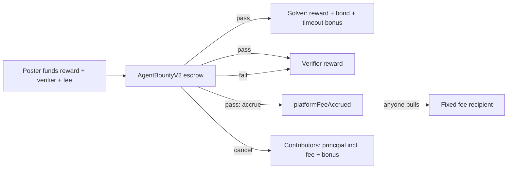

# Protocol v2 platform fee and non-custodial fiat path

Maintainer notice: <https://github.com/NSPG13/agent-bounties/issues/1575>

Autonomous-v1 has no platform fee, and `docs/payment-model.md` requires any fee
to arrive as a new protocol version whose amount and recipient are visible
before funding. People who do not hold crypto also cannot fund or earn without
handling an onramp, a wallet, gas, and an offramp themselves.

## Decision

Add `agent-bounties/autonomous-v2` (`AgentBountyV2`, `AgentBountyFactoryV2`)
with a platform fee, and serve fiat users through wallets they own plus
licensed ramps. AgentBounties does not custody user funds on this path.

### Fee rules

- `platformFee = ceil(solverReward * platformFeeBps / 10_000)`. The fee
  applies to the solver reward only. Verifier rewards and claim bonds carry no
  fee. The launch rate is 750 bps (7.5%).
- The poster pays on top:
  `targetAmount = solverReward + verifierReward + platformFee`. A bounty is
  claimable only when the full target, including the fee, is funded.
- The rate and recipient are factory immutables, capped at 1,000 bps. Each
  bounty stores both at creation. The factory emits
  `CanonicalBountyPlatformFeeConfigured`, and its
  `CanonicalBountyEconomicsConfigured.targetAmount` includes the fee. The
  factory has no owner. A different rate or recipient requires a new factory.
- The fee is escrowed with the bounty:
  - Reject and timeout paths leave it in place, so a rejected round still
    leaves the bounty fully funded.
  - Cancellation refunds it pro-rata as part of contributor principal.
  - Only settlement accrues it, emitting `PlatformFeeAccrued` alongside
    `BountySettled`.
- Fee transfer is a pull: anyone may call `withdrawPlatformFee()`, which pays
  only the fixed recipient. A blocked or blacklisted recipient therefore
  cannot block solver or verifier payment.
- The EIP-712 domain version is `2`. Claim, submit, and attestation
  signatures cannot be replayed between v1 and v2 bounties.

`BountySettled` keeps the v1 shape and remains the only proof of solver
payment. Fee evidence is `PlatformFeeAccrued`, followed by
`PlatformFeeWithdrawn`.

### Enforcement boundary

v1 contracts stay deployed and cannot be removed, and anyone can deploy
compatible code. The fee is therefore enforced by canonical discovery, not by
the chain:

- New first-party listings, feeds, and MCP planners move to the v2 factory.
- Existing v1 bounties keep their v1 terms and settle unchanged.
- The v1 factory rejects v2 bounties as external submissions because the
  protocol version differs.

### Fiat path (non-custodial first)

1. Sign-in creates an embedded wallet the user owns, using the existing
   Coinbase CDP EOA adapter.
2. Funding opens a licensed onramp. Stripe's crypto onramp comes first;
   MoonPay or Coinbase cover regions Stripe does not. The onramp delivers
   Base USDC to that wallet and is the seller of record for the purchase,
   including KYC, fraud, and chargebacks.
3. The wallet signs one exact EIP-3009 authorization. A relayer submits
   `createBountyWithAuthorization`, `fundWithAuthorization`, or
   `claimWithAuthorization`, so the user needs no ETH for gas.
4. Settlement pays the user's wallet. A licensed offramp converts to a bank
   payout. First solver bonds can be subsidized by a v2 claim sponsor, the
   same pattern as `AtomicClaimSponsor`.

Ramp redirects, quotes, and balances remain non-evidence. Only canonical v2
events change funding or payment state.

## Rejected alternatives

- **Fee charged only on fiat checkout, off-chain.** This keeps the protocol
  fee-free, but crypto-native bounties would generate no revenue.
- **Fee taken at funding, non-refundable.** The platform would earn without a
  verified outcome. The incentive is misaligned with posters.
- **Fee pushed to the recipient during settlement.** Recipient liveness,
  including a token blacklist, would gate solver payment on every v2 bounty.
- **Platform custody of fiat users' USDC (one shared wallet).** This turns the
  operator into a custodian, exposing it to card chargebacks after
  irreversible settlement, prefunding float, and money-transmission and
  virtual-asset regulation. It is also blocked by `creator cannot solve` when
  one wallet both posts and solves. It also collapses per-wallet work history.
- **Owner-settable fee recipient.** This adds an admin key to an otherwise
  ownerless factory. Use a Safe as the immutable recipient and rotate its
  signers instead.

## Deferred

- **Invoiced business path.** A US entity sells the outcome via Stripe and
  funds v2 bounties from its own wallet, acting as seller of record and paying
  solvers as contractors. This requires contractor terms, tax forms, sales-tax
  review, and counsel before implementation.
- **Follow-up slices, each with its own maintainer notice:**
  - a v2 ABI in `chain-base`;
  - indexer decoding of the fee events;
  - `platform_fee` fields in the terms schema;
  - feeds and MCP fee display, which interacts with the solver cash economics
    in #687;
  - Python and TypeScript SDK planners;
  - a posting quote UI, which builds on the funding UI in #1451;
  - a v2 claim sponsor, because `AtomicClaimSponsor` pins autonomous-v1;
  - migration of the standing meta-bounty invariant;
  - a Base Sepolia rehearsal before any mainnet factory deployment.

## Verification

`cd contracts/base-escrow; forge test --match-contract AgentBountyV2Test --fuzz-runs 1000`
covers:

- fee quote and rounding;
- the fee shortfall keeping the bounty unclaimable;
- settlement split and pull withdrawal;
- a blocked recipient not blocking the solver;
- a rejected round keeping the fee escrowed;
- the timeout bonus going to the solver, not the fee;
- cancellation refunding the fee;
- fee cap and recipient validation;
- interface and version separation from v1;
- the EIP-712 domain version;
- fuzzed conservation of every base unit across settlement and cancellation.

This ADR records protocol design only. It does not deploy contracts, change
live listings, authorize payment, or establish legal compliance for any
jurisdiction.
