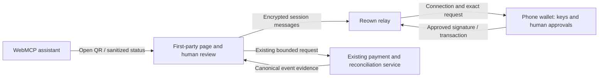

# Phone-wallet QR pairing

Agent Bounties can pair a WalletConnect-compatible phone wallet from an internal
browser without an extension. Choose **Connect phone wallet**, scan with the
wallet app, check `agentbounties.app`, and approve the connection. The same
approved Base session can be used on posting, participation, competition proof,
onramp and account-linking pages. Each signature and transaction remains a
separate wallet approval. Connecting does not link an account or authorize money.

WebMCP exposes `agent_bounties_open_phone_wallet` and
`agent_bounties_get_phone_wallet_status`. Opening prepares the QR; only an
approved, unexpired Base session reports `connected`. These tools preserve the
current journey and return no pairing URI, session keys or signatures. The
assistant can use the returned public address to prepare the existing review.
Human publication, funding, payment and ownership-signature reviews still apply.

## Data flow and authority review (R3)



Authority: the maintainer configures the public relay project and origin;
the browser holds transport keys; the human's wallet alone authorizes signatures;
existing exact-amount reviews bound economic exposure; canonical settlement
events alone prove payment. WebMCP receives no signing or spending authority.
The maintainer requested this QR feature and deployment using admin bypass.
That release authorization does not extend to a real wallet approval or payment.

1. A small shared EIP-6963 facade advertises **Phone wallet (QR)**. It does not
   replace an injected browser wallet or load a relay on initial page view.
2. Opening QR pairing lazily loads the pinned, first-party SDK bundle. Reown
   relays encrypted WalletConnect messages between this browser and the wallet.
   The browser displays the pairing URI only as a locally generated QR image.
   The public project ID is an origin-allowlisted service identifier, not a key.
3. The session requests Base and bounded wallet method permissions, not a
   delegate, agent budget, token allowance or standing signing authority. The
   private key stays in the phone wallet. Existing payment journals, call
   validation and canonical evidence reconciliation decide progress and payment.
4. The SDK persists session transport material in browser storage; a separate
   opaque storage prefix selects the approved session across pages. WebMCP sees
   only a public account, chain, status and next step. No raw SDK error, URI or
   session object enters tool results, page URLs or analytics. Optional SDK
   telemetry and logging are disabled. Privacy policy describes the relay and
   browser retention. No embedded wallet, exchange or custody feature is loaded.

The QR is a temporary connection secret: never put it into chat, logs or public
evidence. A compromised same-origin script could access browser session keys;
this change does not grant it a wallet private key or remove phone approvals.
The dependency lockfile and deterministic bundle check bound shipped SDK code.
The unused AppKit modal is excluded at build time, including unrelated wallet
and exchange adapters. No CDN runtime dependency is used.

## Failure and recovery behavior

- Cancel, escape, page exit, rejection, timeout and invalid Base account erase
  the visible QR and fail the pending connection. New attempts use isolated SDK
  instances and storage prefixes. A late approval is disconnected without
  replacing a newer session while the page remains open; the deprecated SDK
  abort method is not relied on. If the browser closes before cleanup completes,
  revoke any leftover session in the phone wallet. A cancelled session prefix is
  never selected for later restoration.
- Reopening an approved session does not ask for another connection approval.
  It never replays a signature or transaction. Account changes and revocation
  are read from the approved session; existing reviews recheck the signer.
- Unknown transaction errors retain their original code and propagate once.
  Missing approved methods return EIP-1193 `4200` before dispatch, allowing only
  the existing explicit unsupported-batch fallback. Network errors never trigger
  that fallback. Canonical events still determine settlement.
- Disconnect in the page or revoke the connection in the phone wallet. If the
  relay cannot confirm disconnection, the UI says so and blocks further requests.
  Disconnection does not revoke earlier onchain approvals or delete public work.
- Missing deployment configuration disables pairing with an actionable message;
  ordinary browser wallets and draft preparation remain available.

## Build and verification

```sh
cd tools/phone-wallet
npm ci --ignore-scripts
npm run build
npm run check
cd ../..
node --test scripts/test-phone-wallet.js scripts/test-webmcp.js scripts/test-competition-proof.js
python scripts/check-site.py
```

The committed bundle is lazy loaded and capped at 200 kB gzip. Pages verifies
its exact rebuild from the lockfile. Set the repository's public
`WALLETCONNECT_PROJECT_ID` variable, and allowlist the exact production origin in
Reown. Pages validates and injects it with `scripts/configure-phone-wallet.py`;
no server-side credential belongs in that file. For local testing, run the same
script with a test project ID in the environment and restore the empty tracked
config before committing. Localhost is supported by the relay allowlist.

The release canary checks that production loads the configured QR dialog in an
internal browser, reports pending connection through WebMCP, and cancels cleanly.
A real phone approval/signature requires its owner; automated fixtures do not
prove device interoperability or actual funds movement. Roll back the frontend
commit to remove the feature, preserving all marketplace drafts, backend state
and canonical payment records. Revocation remains available in the phone wallet.
