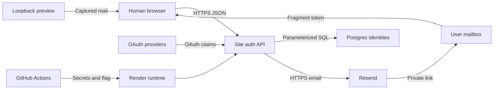

# Site password authentication threat model

## Executive summary

The highest-risk areas are verified-email account merging, recovery-token and session handling, and credential-stuffing pressure on the public API. The design keeps human credentials separate from agent and payment authority, stores only salted password hashes and opaque token hashes, and ships disabled-first. The main residual risks are mailbox compromise, deployment misconfiguration, and transactional merge defects that could misattribute linked-wallet activity.

## Scope and assumptions

In scope: `crates/api/src/site_auth.rs`, the site-auth portion of `crates/db/src/lib.rs`, migration `0028_site_auth_password_accounts.sql`, the homepage account dialog, local capture server, Resend configuration, and Render deployment controller. OAuth, wallet-link attribution, and account statistics are in scope only where identity linking can affect them.

Out of scope: bounty authorization, contracts, settlement, payment rails, MCP, CLI, public discovery, agent tokens, MFA, passkeys, and email-address changes. The user-approved service context establishes these assumptions:

- The API is internet-facing on Render; the public website sends credentials only to the configured API origin over HTTPS.
- Email/password accounts are for people. Autonomous agents do not receive or use human passwords.
- Email addresses and account associations are personal data. Provider subjects, password hashes, action tokens, session tokens, and secrets are confidential security data.
- Accounts are multi-identity and may have multiple linked public wallets, but verified-email ownership is globally unique.
- Google and GitHub verified email can authorize a merge. Microsoft and Amazon claims cannot without an Agent Bounties verification action.
- Resend uses only `auth.agentbounties.app`; root forwarding records remain unchanged.

Open questions that would change risk ranking: production user scale and alert thresholds are deployment-private; mailbox-compromise recovery beyond reset is deferred; regional privacy and retention requirements need operator review before broader launch.

## System model

### Primary components

- Static account dialog/dashboard in `site/index.html` and `site/solarpunk-home.js`.
- Axum site-auth routes and Resend client in `crates/api/src/site_auth.rs`.
- Postgres identities, verified emails, credentials, actions, sessions, and attempts in migration `0028`, accessed by `PostgresStore`.
- Google, GitHub, Microsoft, and Amazon OAuth providers.
- Render/GitHub Actions configuration in `render.yaml` and `.github/workflows/render-deploy-recovery.yml`.
- Loopback-only captured-mail preview in `scripts/serve-solarpunk-auth.py`.

### Data flows and trust boundaries

- Browser → API: email/password JSON and opaque cookies over HTTPS; allowed `Origin`, credential-enabled CORS, bounded fields, NFC normalization, password policy, and credential-route rate limiting. Evidence: `site_auth::router`, `origin_is_allowed`, `normalize_email`, `normalized_password`.
- API → Postgres: normalized identities, Argon2id PHC strings, and SHA-256 token/session hashes; parameterized SQL, constraints, row locks, and merge transactions. Evidence: `upsert_site_auth_identity`, `complete_site_auth_password_action`, migration `0028`.
- API → Resend: recipient, branded text/HTML, and one-time link over TLS with bearer authorization, User-Agent, and stable idempotency. Evidence: `deliver_auth_email` and `RESEND_API_KEY` wiring.
- OAuth providers → API: provider subject/profile claims over OAuth HTTPS; only verified Google/GitHub email is merge authority. Evidence: `provider_profile`, `finish_oauth`.
- Mailbox → Browser → API: a URL-fragment token is removed immediately, hashed, used once, and exchanged for a separate hashed HttpOnly setup cookie. Evidence: homepage hash handling, `verify_password_action`, `verify_site_auth_email_action`.
- CI/operator → Render: feature flag, sender configuration, and secrets through GitHub Actions/Render secret storage; evidence is redacted. Evidence: `normalize_site_auth_environment`, workflow mappings.
- Local browser → preview: captured actions and preview-only credentials on loopback. Evidence: `LocalAuthServer`, `/auth/dev/captured-mail`.

#### Diagram

## Assets and security objectives

| Asset | Why it matters | Security objective (C/I/A) |
| --- | --- | --- |
| Password hashes and policy | Compromise enables offline guessing or weak-account takeover. | C/I |
| Email-action and session tokens | Bearer capability authorizes setup, recovery, or private access. | C/I |
| Canonical identity and verified-email mapping | Incorrect ownership can expose statistics or reassign wallets. | I/C |
| Linked-wallet attribution | Connects an account to public earnings, spending, and rank. | I/C |
| OAuth identity claims | A verified claim can authorize automatic merge. | I |
| Resend and HMAC secrets | Compromise enables spoofed mail or token/rate-limit attacks. | C/I |
| Credential endpoint availability | Login/recovery must not degrade agent-native routes. | A |
| Migration and deploy evidence | Proves safe promotion, rollback state, and redaction. | I/C |

## Attacker model

### Capabilities

A remote unauthenticated attacker can call password endpoints, submit arbitrary bounded JSON, vary email casing/Unicode, reuse tokens, measure responses, and attempt stolen/common passwords. An attacker may control an unverified Microsoft/Amazon claim, a GitHub account without a verified address, or a compromised mailbox/browser session. A repository contributor can propose code but cannot directly read production secrets.

### Non-capabilities

The attacker is not assumed to control Render, Postgres, GitHub Actions, Resend, DNS, or a verified provider/mailbox unless the abuse path says so. Human login does not confer wallet signing, funding, settlement, MCP, CLI, or agent authority. Public wallet activity is not itself confidential.

## Entry points and attack surfaces

| Surface | How reached | Trust boundary | Notes | Evidence (repo path / symbol) |
| --- | --- | --- | --- | --- |
| Seven password POST routes | Public browser/API | Internet → API | Origin checked; credential-only controls. | `crates/api/src/site_auth.rs::router` |
| Session/account/logout | Browser cookie | Internet → API/DB | Opaque eight-hour hash; explicit revocation. | `current_user`, `logout`, `site_auth_sessions` |
| Four OAuth callbacks | Provider redirect | Provider → API | State-bound, provider-specific authority. | `finish_oauth`, `provider_profile` |
| Resend email API | API outbound | API → vendor | Bearer secret, idempotency, recipient PII. | `deliver_auth_email` |
| Identity migration/merge | Runtime migration/sign-in | API → DB | Forward-only DDL and transactional reassignment. | migration `0028`, `merge_site_auth_accounts` |
| Captured mailbox | Loopback GET | Preview → browser | Must be unavailable outside capture mode. | `captured_mailbox`, local server |
| Deploy recovery workflow | Main CI/manual dispatch | CI → Render | Secret reconciliation and disabled-first flag. | workflow, `render_deploy_recovery.py` |

## Top abuse paths

1. Credential stuffing: rotate passwords and email variants, find reuse, receive a session, and view linked-wallet statistics.
2. Enumeration: compare registration, reset, login, delivery latency, and Argon2 timing to classify an email.
3. Recovery replay: steal a link from history/logs/mailbox, reuse it, and attempt to retain an older session.
4. Forced merge: present an unverified provider email equal to a victim and attempt to inherit wallets or credentials.
5. Merge race: race valid sign-ins on one verified address so partial reassignment leaves split or wrong ownership.
6. Resource exhaustion: trigger Argon2 work or email sends until human auth or unrelated agent routes degrade.
7. Mail spoofing: steal the Resend key or misconfigure DNS/sender state to phish users or damage reputation.

## Threat model table

| Threat ID | Threat source | Prerequisites | Threat action | Impact | Impacted assets | Existing controls (evidence) | Gaps | Recommended mitigations | Detection ideas | Likelihood | Impact severity | Priority |
| --- | --- | --- | --- | --- | --- | --- | --- | --- | --- | --- | --- | --- |
| TM-001 | Remote credential stuffer | Known email and reused/common password | Automates login until one succeeds. | Private account view and account actions exposed. | Passwords, sessions, identities | Argon2id 19 MiB/t=2/p=1, blocklist, dummy hash, durable limiter (`normalized_password`, `site_auth_attempt_allowed`). | Threshold tuning/distributed sources are operational. | Conservative canary limits; alert on success after repeated failures; consider breached-password screening without sending raw passwords. | Failure/success ratio, subject hashes, Argon latency. | high | high | high |
| TM-002 | Remote enumerator | Candidate emails and response timing | Compares bodies, status, delivery behavior, or hashing latency. | Identifies phishing/stuffing targets. | Email privacy | Generic accepted registration/reset, generic login error, dummy PHC (`PASSWORD_GENERIC_MESSAGE`, `DUMMY_PASSWORD_HASH`). | External mail timing can differ; dummy baseline needs monitoring. | Dispatch email outside response critical path; regression-test timing envelopes. | Known/unknown synthetic probes and latency distributions. | medium | medium | medium |
| TM-003 | Token thief or compromised mailbox/browser | Action link or active cookie access | Replays action or retains a pre-reset session. | Credential replacement or private access. | Actions, sessions | Hash-only storage, short expiry, one-time exchange, separate setup hash, fragment removal, reset-wide revocation. | Mailbox compromise remains authoritative. | Add reset notification and future MFA/passkeys; never log token material. | Replay failures, reset volume, old-session lookups. | medium | high | high |
| TM-004 | Malicious OAuth account | Controls mutable/unverified provider email | Attempts merge into victim verified-email owner. | Wrong wallet/stat or credential association. | Identity, wallets | Google verified claim; GitHub verified `/user/emails`; Microsoft/Amazon no merge authority (`provider_profile`, `finish_oauth`). | Provider semantics can change. | Pin provider contract tests; periodically review provider docs; require first-party verification for ambiguity. | Merge events by provider and owner changes. | low | high | medium |
| TM-005 | Concurrent actor or defect | Two identity operations race or retry | Causes partial merge, duplicate credential, or lost wallet/session. | Account integrity loss. | Identity, wallets, sessions | Verified-email primary key, locks, one transaction, idempotent DDL, Postgres regression (`upsert_site_auth_identity`, `merge_site_auth_accounts`). | No user-facing bad-merge recovery. | Backup before enable; low-volume canary; add merge audit and repair procedure. | Constraint errors, rollback counts, invariant query. | low | high | medium |
| TM-006 | Resource-exhaustion attacker | Public credential routes | Forces Argon2 work, attempt churn, or Resend sends. | Shared API availability degrades. | Human and agent availability | Durable limiter only on password routes, private concurrency-capped blocking Argon pool, async email dispatch, timeouts, and feature flag (`router`, `hash_password_async`, request handlers). | No persisted IP dimension; distributed subjects can still create work. | Add edge request/body limits without agent auth and alert on blocking-pool saturation. | Event-loop latency, Argon concurrency, Resend rate errors. | medium | high | high |
| TM-007 | Secret thief or DNS/operator error | Resend, CI/Render, or DNS access | Sends spoofed mail, redirects links, or leaks secrets in evidence. | Phishing, reputation loss, takeover. | Resend secret, users, domain | Dedicated subdomain, exact sender, secret storage, redacted evidence, disabled-first release. | DNS/vendor state is external. | Least-privilege key, rotation, SPF/DKIM verification, domain alerts, no root-record changes. | Delivery, bounce, domain, and volume alerts. | low | high | medium |
| TM-008 | Malicious local/network operator | Capture mode exposed via proxy/listener | Reads captured one-time links. | Test-account takeover. | Action tokens | Rust rejects non-loopback capture origin; route 404 otherwise; Python refuses non-loopback host. | Reverse proxy could expose loopback. | Never deploy preview server; production smoke capture route must be 404. | Synthetic production route probe. | low | high | medium |

## Criticality calibration

- Critical: unauthenticated takeover of arbitrary accounts; extraction of credential/session/Resend secrets at scale; human login granting wallet or settlement authority.
- High: practical credential stuffing; stolen reset token retaining access; Argon2/email abuse degrading the shared API.
- Medium: enumeration; provider-claim merge requiring controlled claims; transactional merge failure; secret/DNS compromise requiring another foothold.
- Low: noisy invalid input with no durable effect; local preview misuse without proxy exposure; disclosure of already-public wallet activity without an account association.

## Focus paths for security review

| Path | Why it matters | Related Threat IDs |
| --- | --- | --- |
| `crates/api/src/site_auth.rs` | Public parsing, Argon2, cookies, provider authority, Resend, and route scope. | TM-001, TM-002, TM-003, TM-004, TM-006, TM-007 |
| `crates/db/src/lib.rs` | Locks, merge, session revocation, attempts, and action consumption. | TM-003, TM-005, TM-006 |
| `migrations/0028_site_auth_password_accounts.sql` | Uniqueness, foreign keys, token hashes, expiry/session invariants. | TM-003, TM-005 |
| `site/solarpunk-home.js` | Fragment removal, state transitions, and generic messages. | TM-002, TM-003 |
| `site/privacy.html` | Disclosure of credential, Resend, and retention behavior. | TM-002, TM-007 |
| `scripts/serve-solarpunk-auth.py` | Loopback capture boundary and local recovery tests. | TM-008 |
| `scripts/render_deploy_recovery.py` | Secret reconciliation, feature flag, readiness, redaction. | TM-007, TM-008 |
| `.github/workflows/render-deploy-recovery.yml` | Production secret injection and authority. | TM-007 |
| `render.yaml` | Production defaults, sender, flag, and secret placeholders. | TM-007, TM-008 |

## Quality check

- Covered all password routes, session/account/logout, OAuth callbacks, Resend, Postgres merge/migration, capture mode, and CI/Render promotion.
- Represented browser/API, API/database, API/Resend, OAuth/API, mailbox/browser, CI/Render, and loopback-preview boundaries in threats.
- Separated production runtime, CI/operator configuration, and preview/tests.
- Used the service context explicitly supplied in the approved plan; remaining scale/retention questions are stated above.
- Included no secret value, provider subject, action token, session token, password, or credential hash.
